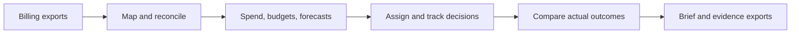
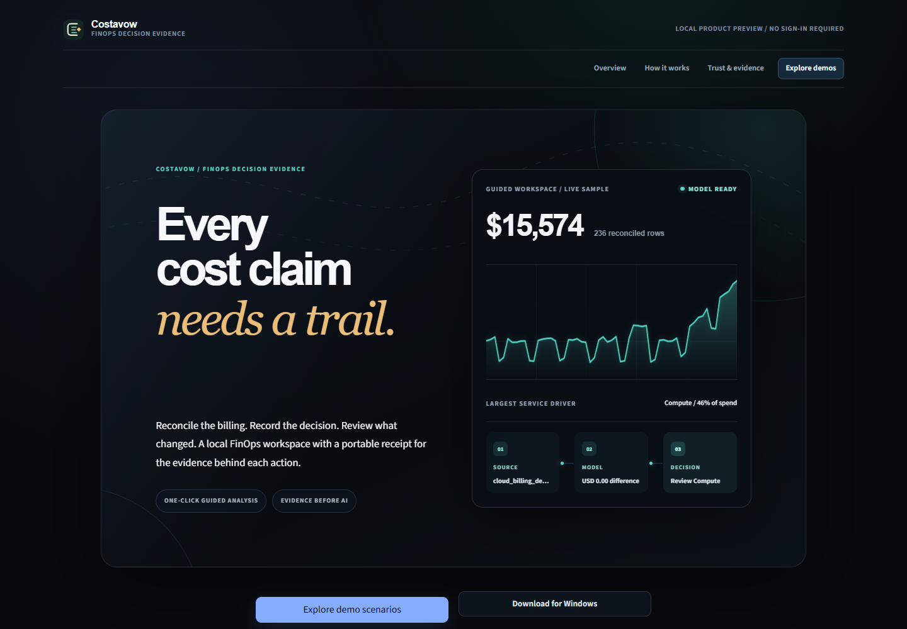
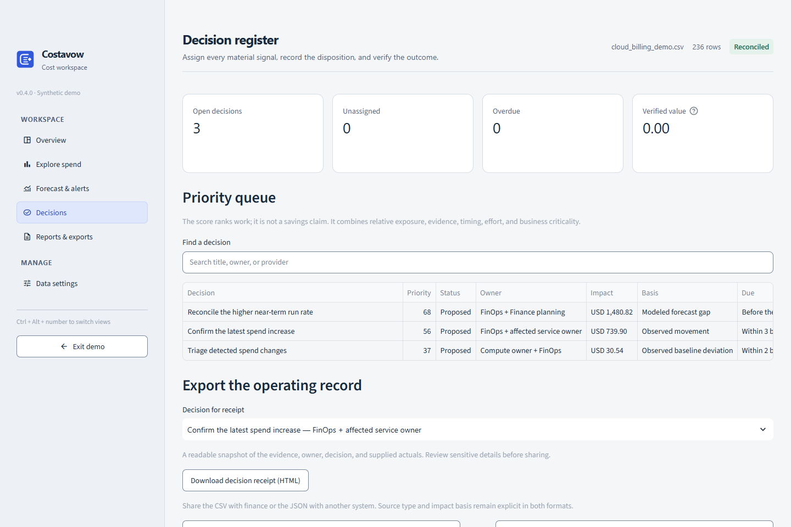

# Costavow


**A local FinOps workspace for evidence, decisions, and measured outcomes.**

[](https://github.com/ndomathoti16-create/Costavow/actions/workflows/ci.yml)
[](https://github.com/ndomathoti16-create/Costavow/releases/latest)

Costavow (formerly Metrora) is a local-first FinOps reference application for finance, engineering, and cloud teams.
It turns billing exports into reconciled cost analysis, connects findings to budgets and business
volume, and records who owns each decision and what happened afterward. A portable decision receipt
keeps the source, financial basis, human disposition, and supplied actuals together.

[**Explore the synthetic demo**](https://metrora.streamlit.app/) ·
[**Download for Windows**](https://github.com/ndomathoti16-create/Costavow/releases/latest) ·
[Documentation](docs/README.md) · [Run from source](docs/DEVELOPMENT.md) · [Changelog](CHANGELOG.md)

## Choose how to use it

| Surface | What you can do | Data and requirements |
| --- | --- | --- |
| Hosted demo | Explore three prepared scenarios and download their reports. | Synthetic data only; no sign-in, uploads, cloud connections, or external AI requests. |
| Windows app | Upload your files, connect billing exports, manage decisions, and export results. | Local processing and storage; the portable ZIP includes Python and optional cloud SDKs. |
| Source or Docker | Run the demo or local workspace and work on the code. | Python 3.11+ or Docker; see the [developer guide](docs/DEVELOPMENT.md). |

[Costavow v0.3.0](https://github.com/ndomathoti16-create/Costavow/releases/tag/v0.3.0) introduces
a light analytical workspace, the Costavow desktop identity, and portable decision receipts.
The old hosted address currently serves the previous styling while the renamed repository is
being redeployed. The Windows release and current source include the new design. See the
[deployment settings](docs/DEVELOPMENT.md#deploy-the-public-costavow-website),
[changelog](CHANGELOG.md), and [design rationale](docs/DESIGN.md).

## What it does

- **Prepare trustworthy inputs:** read CSV, Excel, or Parquet; detect columns; normalize billing;
  reconcile totals; surface blocking errors and quality warnings.
- **Explain cost movements:** compare periods, rank service drivers, inspect ownership coverage,
  and explore forecasts and anomalies with their methods and limitations.
- **Add planning context:** compare budgets and calculate unit costs from supplied business volume.
- **Connect provider evidence:** read AWS S3, Azure Blob Storage, or GCP BigQuery billing exports;
  optionally import AWS Cost Optimization Hub recommendations.
- **Track decisions:** assign owners, due dates, status, risk, and rejection reasons. Compare
  user-supplied baseline and post-change costs without treating provider estimates as realized savings.
- **Share the result:** export a decision receipt, executive HTML brief, cleaned data, register, fact pack,
  and quality report. An optional AI provider can rewrite calculated evidence for human review.

Cloud connectors read data and recommendations; they do not resize, stop, or delete resources.
Provider credentials and an AI key are unnecessary for file-only analysis.

## Why this project exists

Enterprise FinOps platforms already offer rich reporting, unit economics, and optimization.
Costavow focuses this reference application on an inspectable handoff: **what the bill supports,
who decided, and what was observed afterward**. This is a deliberate product scope, not a claim
that competitors lack accountability workflows. See the [market review and design rationale](docs/PRODUCT_STRATEGY.md).

## Inspect the engineering

| Capability demonstrated | Evidence to inspect |
| --- | --- |
| Data engineering | [Normalization contracts](src/finops_cost_intelligence/contracts/normalization.py), [warehouse schema](src/finops_cost_intelligence/warehouse/schema.sql), and source reconciliation. |
| Analytical judgment | [Metric definitions](docs/METRIC_DEFINITIONS.md), explicit financial bases, and [boundary regressions](tests/test_review_regressions.py). |
| Product and backend design | [Decision records](src/finops_cost_intelligence/decisions/models.py), refresh-preserving merges, and [portable receipts](src/finops_cost_intelligence/decisions/receipt.py). |
| Responsible implementation | Negative tests, escaped exports, local persistence, restricted provider actions, and [documented limits](SECURITY.md). |

**Five-minute review:** open the synthetic demo, choose **Hidden future risk**, inspect **Data settings** for input
quality, open **Decisions**, and download a receipt. Follow its source and fact references into the
report's fact-pack export. The receipt states missing information and keeps provider estimates
separate from supplied actuals. No provider account or API key is needed.

## The workflow



The workspace follows that sequence through **Overview**, **Explore spend**, **Forecast & alerts**,
**Decisions**, **Reports & exports**, **Data sources**, and **Data settings**. Data sources and editing
controls are available in the local workspace. Mapping changes are only needed when automatic
preparation flags an exception or you want to change the accepted cost basis.

## See the product



The [guided demo](https://metrora.streamlit.app/?surface=product&page=Demo) includes:

- **Healthy baseline:** clean, stable spend with ownership and budget context.
- **Data needs review:** deliberately invalid values and mixed currencies that block analysis.
- **Hidden future risk:** reconciled spend with an accelerating run rate and forecast risk.



Screenshots show current Costavow source with synthetic data. Historical v0.2.3 captures remain
in `docs/screenshots`. See the [demo data guide](data/demo/README.md).

## Start on Windows

1. Open the [latest release](https://github.com/ndomathoti16-create/Costavow/releases/latest).
2. Download `Costavow-Windows-x64.zip` and `SHA256SUMS.txt`.
3. Compare the ZIP's SHA-256 hash with the checksum, extract it, and run `Costavow.exe`.

```powershell
Get-FileHash .\Costavow-Windows-x64.zip -Algorithm SHA256
```

Python is not required for the portable app. The native launcher binds its service to `127.0.0.1`
and normally stores local state under `%LOCALAPPDATA%\Metrora`. The executable is unsigned;
Windows may show a SmartScreen warning. Check the source and checksum before deciding to run it.

## Data and trust boundaries

Billing data needs mappable **date**, **service**, and **cost** columns. Currency, account, region,
project, department, environment, resource, and usage fields improve the analysis. See the
[data dictionary](docs/DATA_DICTIONARY.md) and [metric definitions](docs/METRIC_DEFINITIONS.md).

Financial values are calculated before optional AI narration. Malformed or unsupported AI output
falls back to the deterministic summary, but generated wording still requires review. Optional cloud
and AI actions can transmit data; the application describes the selected action and destination.

This is a single-user local workspace, not an authenticated multi-tenant service. Local application
files are not independently encrypted. Forecasts are estimates, and before-and-after billing alone
does not establish causation. Review [security](SECURITY.md), [privacy](PRIVACY.md), and
[known metric limitations](docs/METRIC_DEFINITIONS.md) before using organizational data.

## Repository guide

| Location | Purpose |
| --- | --- |
| [`src/finops_cost_intelligence/`](src/finops_cost_intelligence/) | Application, analytics, provider adapters, and UI. |
| [`tests/`](tests/) | Unit, regression, and Streamlit workflow checks. |
| [`data/demo/`](data/demo/) | Synthetic datasets and their generator. |
| [`docs/`](docs/README.md) | Setup, metric definitions, architecture, and historical research. |
| [`packaging/`](packaging/) | Windows packaging and third-party license inventory. |
| [`infra/aws/`](infra/aws/README.md) | Optional S3/Glue/Athena setup notes. |
| [`.github/`](.github/) | CI, Windows release workflow, and dependency update configuration. |

## Issues, security reports, and licensing

For a reproducible bug, [open an issue](https://github.com/ndomathoti16-create/Costavow/issues/new/choose)
with synthetic data and the affected version. Report vulnerabilities through the private route in
[SECURITY.md](SECURITY.md), not a public issue. See [contribution guidance](CONTRIBUTING.md) before
proposing changes.

**No project distribution license has been selected.** Public visibility does not grant an
open-source license; contact the owner before reuse or redistribution. Third-party components keep
their own licenses and notices; see [THIRD_PARTY_NOTICES.md](THIRD_PARTY_NOTICES.md).
